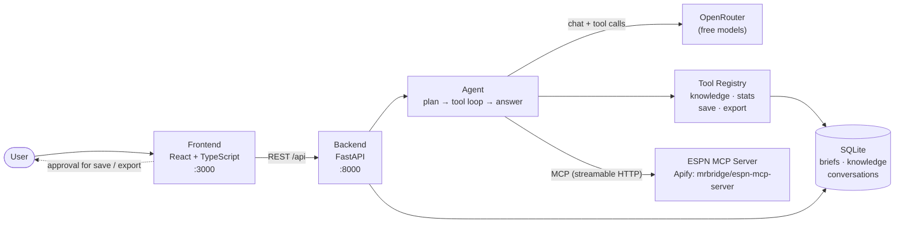

# 🏆 Sports Brief Builder

> An agentic web application that creates sports briefings through natural language. The agent builds plans, executes tools, and requires user approval for sensitive actions.

---

## 📑 Table of Contents

- [Architecture](#architecture)
- [Quick Start](#quick-start)
- [Configuration](#configuration)
- [Tools and Actions](#tools-and-actions)
- [Knowledge System](#knowledge-system)
- [Next Steps](#next-steps)
- [License](#license)

---

## Architecture



1. The frontend sends the user's goal to the FastAPI backend.
2. The agent asks the LLM (via OpenRouter) for a plan, then loops: the model requests tools, the backend executes them (local tools directly, `espn_*` tools through the ESPN MCP server), and the results go back to the model.
3. `save_brief` and `export_brief` are flagged as needing user approval in the UI.
4. The final answer, tool calls and activity log are returned to the frontend.

**Tech Stack:** React + TypeScript, FastAPI + Python 3.11, SQLite, OpenRouter (free models supported), ESPN MCP server on Apify, Docker

---

## Quick Start

### Prerequisites
- **Docker** (Docker Desktop on Windows/macOS, or Docker Engine with the Compose plugin on Linux) — install from https://docs.docker.com/get-docker/ and make sure it is running.
- **OpenRouter API key** (free) — get one at https://openrouter.ai/keys
- **Apify API token** — get one at https://console.apify.com/settings/integrations. It is used to call the [ESPN MCP server](https://apify.com/mrbridge/espn-mcp-server) for live sports data. Apify's pay-per-event pricing applies, and new accounts get free credits. Without a token the app still runs, but live data is unavailable.

### Steps

1. **Configure environment:**
   ```bash
   cp .env.example .env
   nano .env  # Add your OpenRouter API key and Apify token
   ```

2. **Start the application:**
   ```bash
   bash start.sh
   ```

3. **Test it works (optional):**
   ```bash
   bash test.sh
   ```

4. **Open the browser:** http://localhost:3000

### Try These Prompts
- "Create a brief about the latest NFL games"
- "Show me latest football scores"
- "Generate player performance statistics"
- "Tell me about NBA teams using the knowledge base"
- "Create a brief and save it to database" *(tests approval flow)*

---

## Configuration

| Variable | Required | Default | Description |
|----------|----------|---------|-------------|
| `OPENROUTER_API_KEY` | Yes | — | Your OpenRouter API key |
| `OPENROUTER_MODEL` | No | `openai/gpt-oss-20b:free` | Any OpenRouter model that supports tool calling |
| `APIFY_TOKEN` | For live data | — | Apify token used to authenticate to the ESPN MCP server |
| `ESPN_MCP_URL` | No | `https://mrbridge--espn-mcp-server.apify.actor/mcp` | Override the MCP endpoint |

Browse free, tool-capable models: https://openrouter.ai/models?supported_parameters=tools&max_price=0

---

## Tools and Actions

### 🛠️ Server Tools

**Local tools**

| Tool | What It Does | Approval Required |
|------|-------------|-------------------|
| **search_knowledge** | RAG search through knowledge base with relevance scoring | No |
| **save_brief** | Persists briefs to SQLite database | ✅ Yes |
| **generate_statistics** | Creates statistical analyses (player/team/season) | No |
| **export_brief** | Exports briefs as Markdown/TXT/JSON files | ✅ Yes |

**ESPN MCP tools** (live data, provided by [mrbridge/espn-mcp-server](https://apify.com/mrbridge/espn-mcp-server) on Apify)

The backend connects to the server over MCP and discovers its tools at the start of each request (cached for 5 minutes), so whatever the server offers is available to the agent. At the time of writing these include `espn_scoreboard`, `espn_live_scoreboard`, `espn_standings`, `espn_teams`, `espn_team_roster`, `espn_team_schedule`, `espn_news`, `espn_game_summary`, `espn_game_odds`, `espn_athletes`, `espn_rankings`, `espn_search` and `espn_play_by_play`. None of them require approval.

The old mocked `fetch_live_scores` tool was removed. If the MCP server is unreachable or `APIFY_TOKEN` is missing, the agent is told live data is unavailable and does not invent scores.
### 🎨 Client Actions (Observable UI Changes)

| Action | Trigger | Observable Behavior |
|--------|---------|-------------------|
| **Scoreboard Widget** | any `espn_*` tool returning games | Animated card appears with team scores |
| **Statistics Chart** | `generate_statistics` | Bar chart animates (0.5s transitions) |
| **Knowledge Pulse** | `search_knowledge` | Used knowledge badges pulse 3x in amber |
| **Activity Log** | Every tool call | Real-time updates with color-coded status |
| **Brief Count** | `save_brief` (approved) | Counter increments, brief appears in sidebar |

---

## Knowledge System

1. **Database:** SQLite table `knowledge` (6 pre-loaded items: teams, players, rules, stats)
2. **User additions:** Via UI upload (.txt/.md files) or manual form input
3. **No vector DB:** Uses SQL LIKE queries for text matching and basic relevance scoring

---

## Next Steps

- Real sports API integration (ESPN/Sportradar)
- Vector embeddings for semantic search (e.g. via OpenRouter embeddings)
- Streaming responses via SSE
- Multi-agent architecture (specialist agents per domain)
- Approval history and undo functionality
- Rich client visualizations (timelines, formation diagrams)
- User accounts and personalization
- Collaboration features (share briefs, comments)
- Advanced analytics on agent performance
- AWS Deployement

---

## License

MIT License - Use as a template for your own agentic applications!

**More documentation:** [PROJECT_STRUCTURE.md](PROJECT_STRUCTURE.md) | [WEB_PROOF.md](WEB_PROOF.md)
